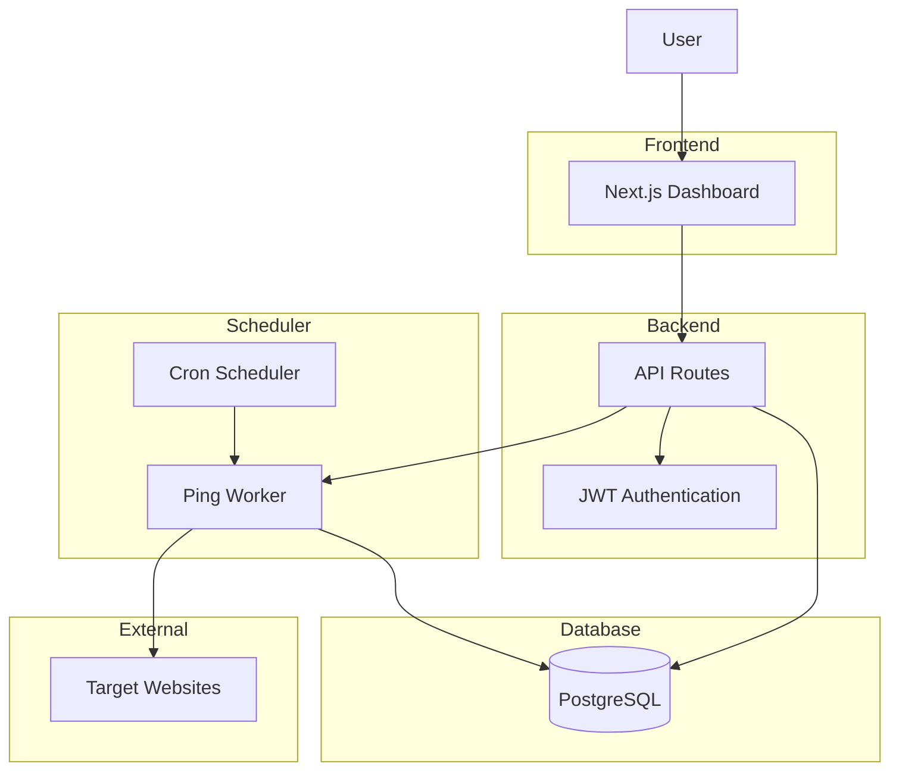
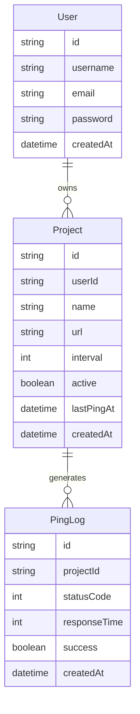
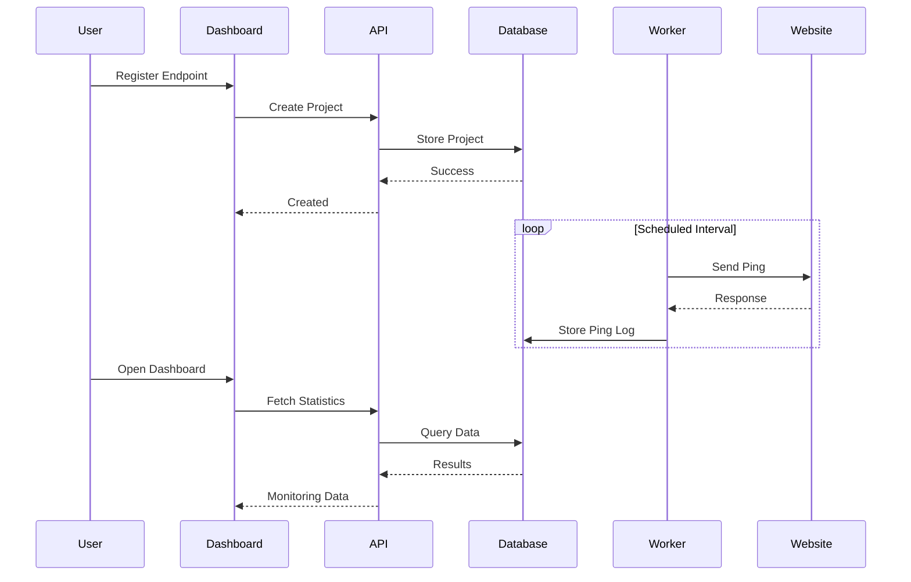
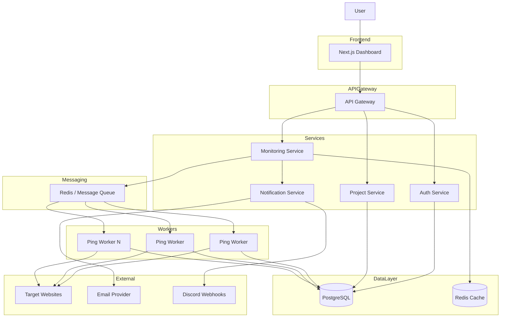

# HotRoute

> Keep your services warm.

HotRoute is a cold-start prevention and service monitoring platform that keeps web applications responsive by sending scheduled health-check requests. Users can register endpoints, configure ping intervals, monitor response metrics, and track service health from a centralized dashboard.

---

# Features

## Authentication

* User Registration
* User Login
* JWT Authentication
* Protected Routes

## Project Management

* Add Endpoint
* Edit Endpoint
* Delete Endpoint
* Enable / Disable Monitoring

## Monitoring

* Automated Scheduled Pings
* Response Time Tracking
* Status Code Tracking
* Ping History Logs
* Last Successful Ping

## Dashboard

* Total Monitored Services
* Active Services
* Recent Activity
* Health Status Overview

---

# Tech Stack

## Frontend

* Next.js
* TypeScript
* Tailwind CSS

## Backend

* Next.js Route Handlers
* JWT Authentication

## Database

* PostgreSQL
* Prisma ORM

## Scheduling

* Cron Jobs (V1)
* Worker Infrastructure (Future)

---

# System Architecture



---

# Database Architecture



---

# Request Flow



---

# Project Structure

```text
src/
│
├── app/
│   ├── api/
│   │   ├── auth/
│   │   ├── projects/
│   │   └── ping/
│   │
│   ├── login/
│   ├── signup/
│   ├── dashboard/
│   └── projects/
│
├── components/
│
├── lib/
│   ├── prisma.ts
│   ├── auth.ts
│   └── scheduler.ts
│
├── prisma/
│   └── schema.prisma
│
├── middleware.ts
│
└── types/
```


# Future Scalable Architecture



---

# Roadmap

## Version 1.0

* Authentication
* Endpoint Management
* Scheduled Pings
* Monitoring Dashboard
* Ping Logs

## Version 2.0

* Redis Queue
* Background Workers
* Email Alerts
* Service Analytics
* Failure Notifications

## Version 3.0

* Multi-region Workers
* Team Workspaces
* Webhooks
* Billing System
* SLA Monitoring

---

# Goal

HotRoute aims to eliminate cold-start delays and improve application responsiveness by ensuring services remain active, monitored, and ready to handle traffic.
